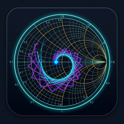
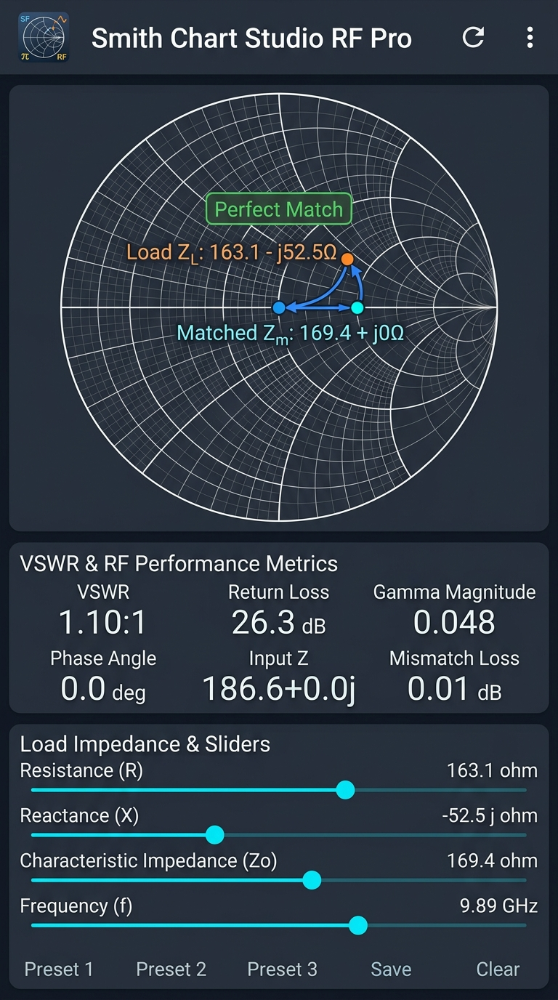
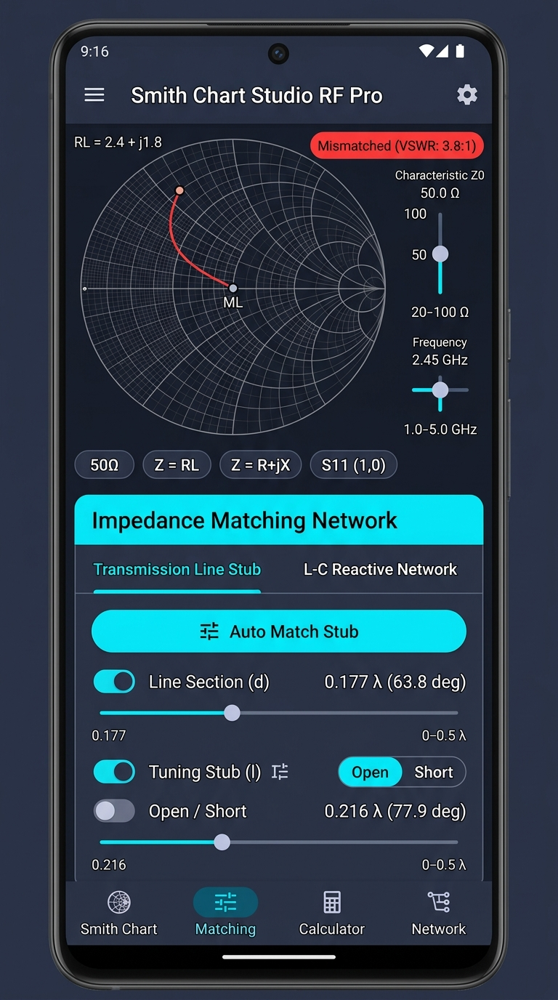
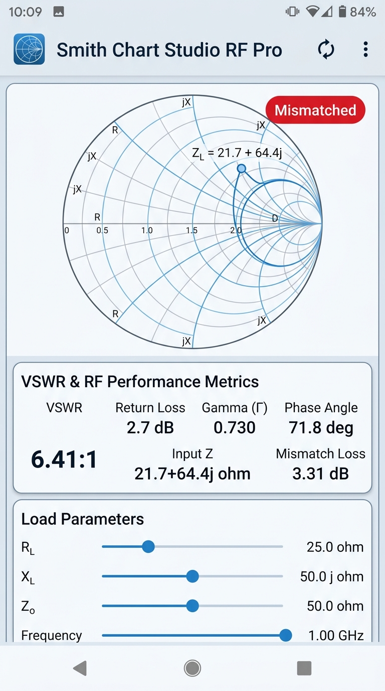
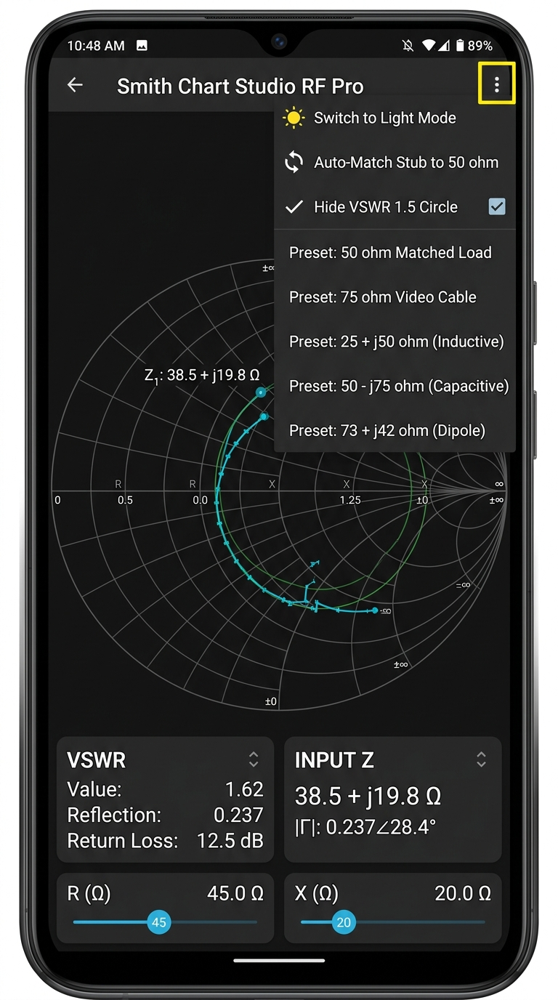

<p align="center">
  
</p>

<h1 align="center">Smith Chart Studio (RF Pro)</h1>

<p align="center">
  <strong>Interactive Real-Time RF Complex Impedance Calculator & Matching Network Analyzer for Android</strong>
</p>

<p align="center">
  
  
  
  
</p>

---

## 📖 Overview

**Smith Chart Studio** is a modern, high-precision radio frequency (RF) engineering tool designed for engineers, students, and amateur radio operators. Built with 100% native **Kotlin** and **Jetpack Compose**, it delivers direct tactile impedance navigation on an interactive Smith Chart with dense wireframe circles, real-time VSWR and Return Loss analytics, transmission line stub matching, lumped $L-C$ networks, and one-tap industry standard presets.

---

## 📱 Screenshots

<table align="center">
  <tr>
    <td align="center" width="50%">
      <strong>Interactive Smith Chart (Dark Mode)</strong><br/>
      
    </td>
    <td align="center" width="50%">
      <strong>Transmission Line Stub Matching</strong><br/>
      
    </td>
  </tr>
  <tr>
    <td align="center" width="50%">
      <strong>High-Contrast Light Theme</strong><br/>
      
    </td>
    <td align="center" width="50%">
      <strong>RF Presets & Overflow Menu</strong><br/>
      
    </td>
  </tr>
</table>

---

## ⚡ Core Features

- **Fixed Interactive Smith Chart Canvas**:
  - High-density wireframe grid with constant resistance circles ($r = 0.1$ to $10.0$) and reactance arcs ($x = \pm 0.2$ to $\pm 5.0$).
  - Visual VSWR circle overlay with match boundary indicators.
  - Direct touch and drag point placement across the complex reflection plane.
- **Real-Time RF Metrics Engine**:
  - Continuous evaluation of Voltage Standing Wave Ratio (VSWR), Return Loss ($S_{11}$ in dB), Reflection Coefficient ($\Gamma$ magnitude and phase angle), and Mismatch Loss.
- **Matching Network Design**:
  - **Single-Stub Matching**: Series transmission line sections ($d/\lambda$) and shunt tuning stubs ($l/\lambda$) with open/short termination options and one-click auto-matching.
  - **L-C Reactive Elements**: Interactive series capacitor and series inductor sliders for frequency-dependent compensation.
- **Parametric Sliders & Exact Input**:
  - Rapid tuning for load resistance ($R_L$), load reactance ($X_L$), reference impedance ($Z_0$), and RF operating frequency ($f$).
  - Dialog for direct numeric keyboard input with 50Ω, 75Ω, inductive, and dipole antenna presets.
- **Dark & Light Mode Support**:
  - Sleek engineering dark theme and crisp high-contrast daylight theme.

---

## 🚀 How to Build the APK

### Automated GitHub Actions (No Local Setup Required)
1. Push or fork this repository on GitHub.
2. Go to the **Actions** tab in your repository.
3. Select the **Build Android APK** workflow and click **Run workflow**.
4. Once the workflow completes, download the generated `app-debug-apk` artifact directly to your Android device and install!

### Local Development (Android Studio)
1. Clone this repository:
   ```bash
   git clone https://github.com/your-username/smith-chart-calculator.git
   ```
2. Open Android Studio (Ladybug / Iguana or later).
3. Select **Open an Existing Project** and choose the repository root.
4. Allow Gradle to sync dependencies, then click **Run** (`Shift + F10`) to launch on your device or emulator.

